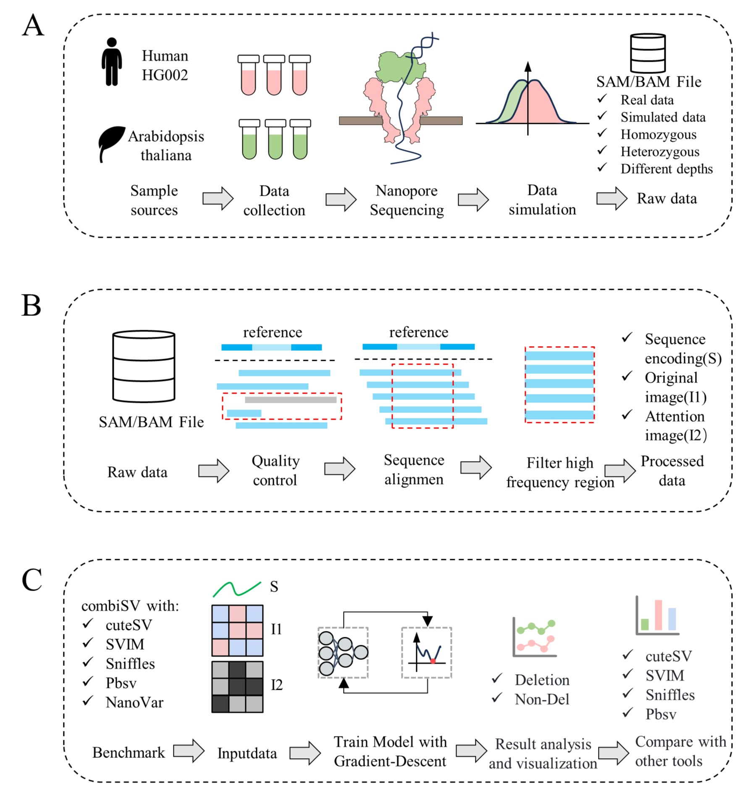

# DASV

**Deletion variants calling in third-generation sequencing data based on a dual-attention mechanism**

Our method achieved the best results on all datasets. And we have submitted the manuscript to [briefings in bioinformatics](https://academic.oup.com/bib/).

